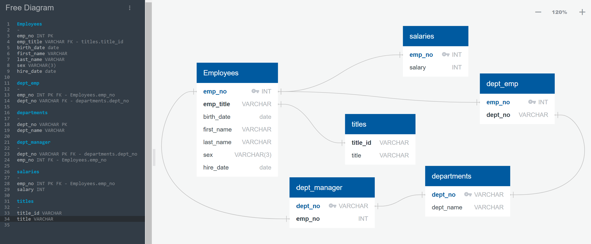
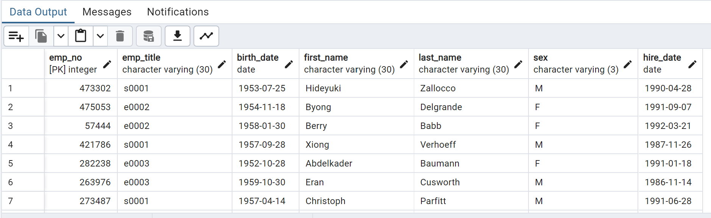

# sql-challenge

What if you had ancient csv files containing historical data on employees at your company in the 1980s and the 1990s and you needed to pull information from them?  Perhaps you could use Excel, but what if the files are large and are in tables that might lend themself to being used in a database?

This challenge imports these csv files into a SQL database engineered for the purpose.  The data were modeled and an entity relationship diagram was created.  This helped in developing the schema for storing the data in the relational database structure.

Once the data were in the SQL database, querying with SQL allowed for analysis of the data and finding the required information.

I used the Xpert Learning Assistant tool for a few of the steps in the project.

Most importantly, I learned how to filter by dates  -  I asked how to get all employees hired in 1986 and it told me to use this code

SELECT hire_date
FROM employees
WHERE hire_date >= '1986-01-01' AND hire_date < '1987-01-01';

I wasn't sure what the date formatting was like and this worked.

I also used it to figure out how to count the instances of last names of employees.

I learned from it about COUNT(*)

Code from the AI was

SELECT last_name, COUNT(*) as frequency
FROM your_table_name
GROUP BY last_name
ORDER BY frequency DESC;

I only had to put in the table name as 'employees'

I recognize that the last_names were selected and COUNT(*) was selecting all of the last names 

Khangwelo (tutor) helped me to refine my joins without creating additional tables and using aliases to streamline the code.

